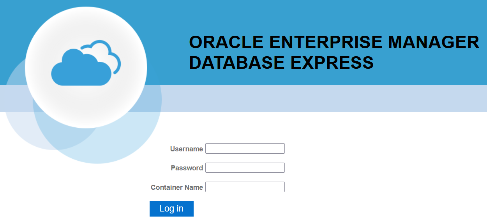

## <p align="center">Oracle 23ai (23.6.0) Free - 21c (21.3.0) Express Edition (XE)</p>

This repository is a helper to deploy an Oracle Free or XE database using docker compose instead of official Oracle linux scripts.

## 🧐 Features    
- Using docker compose version 2
- Traefik as an tcp/http edge proxy
- Oracle free database (Single instance XE version)
- Enterprise manager express available (only version 21)
        
## 🛠️ Tech Stack
- [Oracle Express Free Edition](https://www.oracle.com/fr/database/technologies/appdev/xe.html)
- [Oracle docker](https://github.com/oracle/docker-images/tree/main/OracleDatabase/SingleInstance)
- [Traefik](https://doc.traefik.io/traefik/)


## 🧑🏻‍💻 Usage

```Bash
# Build Oracle Database 23ai (23.6.0) Free
$ docker compose --profile free build

# Build Oracle Database 21c (21.3.0) Express Edition (XE)
$ docker compose --profile xe build
```

```Bash
# Launch Oracle Database 23ai (23.6.0) Free
$ docker compose --profile free up -d

# Launch Oracle Database 21c (21.3.0) Express Edition (XE)
$ docker compose --profile xe up -d
```
**Only for version 21c (21.3.0) Express Edition (XE)** 
- Once up and running, *Enterprise manager database express* webui will be available at [this address](http://oracle.localtest.me/em/login)



```Bash
# Cleaning all volumes
$ docker compose --profile free down -v
$ docker compose --profile xe down -v
```

## 🛠️ Database connection

Access the database using a SQL client like [DBeaver](https://dbeaver.io/), pay attention that the user TEST is created by [this script](db/oracle/scripts/setup/1_create_users.sql) as a setup example.

### Oracle 21.3.0 Express Edition
|User|Password|Host|Port|SID|
|---|---|---|---|---|
|sys as sysdba|secret|oracle.localtest.me|1521|XE|
|system|secret|oracle.localtest.me|1521|XE|
|pdbadmin|secret|oracle.localtest.me|1521|XEPDB1|
|TEST|test|oracle.localtest.me|1521|XEPDB1|

### Oracle 23.3.6 Free Edition
|User|Password|Host|Port|SID|
|---|---|---|---|---|
|sys as sysdba|secret|oracle.localtest.me|1521|FREE|
|system|secret|oracle.localtest.me|1521|FREE|
|pdbadmin|secret|oracle.localtest.me|1521|FREEPDB1|
|TEST|test|oracle.localtest.me|1521|FREEPDB1|

## 🍰 Contributing    
Contributions are what make the open source community such an amazing place to be learn, inspire, and create. 
Any contributions you make are **greatly appreciated**.

## 🙇 Author
#### JS
- Github: [@jsminet](https://github.com/jsminet)
        
## ➤ License
Distributed under the MIT License. See [LICENSE](LICENSE) for more information.
        